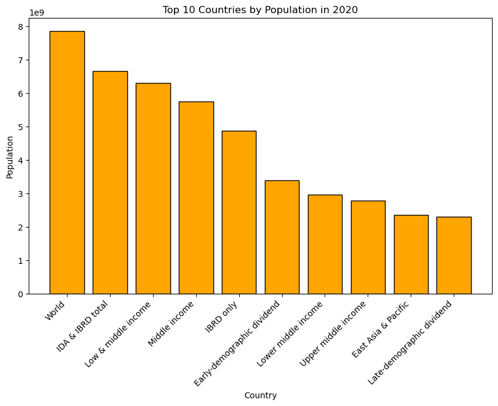

# Prodigy InfoTech - Data Science Internship

📊 Task-01 Report

Title: Population Distribution Analysis

✅ Problem Statement

Create a bar chart or histogram to visualize the distribution of a categorical or continuous variable, such as the distribution of ages or genders in a population.
For this task, we analyzed the distribution of country populations (2020) from the given dataset.

📂 Steps Taken

Loaded the dataset (World Development Indicators).

Cleaned column names and selected the relevant year (2020).

Created a Histogram to show population distribution across countries.

Created a Bar Chart of the Top 10 most populated countries in 2020.

📈 Visualizations
1. Histogram – Population Distribution

Shows how countries are distributed by population size.

Most countries have populations under 100 million.

2. Bar Chart – Top 10 Populated Countries (2020)

China and India have the highest populations.

USA, Indonesia, Pakistan, Brazil, Nigeria, Bangladesh, Russia, and Mexico follow.

🔑 Key Insights

Majority of countries have smaller populations (<100M).

China and India together account for a huge share of the global population.

Other countries have significantly smaller populations in comparison.

🛠️ Technologies Used

Python

Pandas

Matplotlib

✅ Task-01 Completed Successfully.
